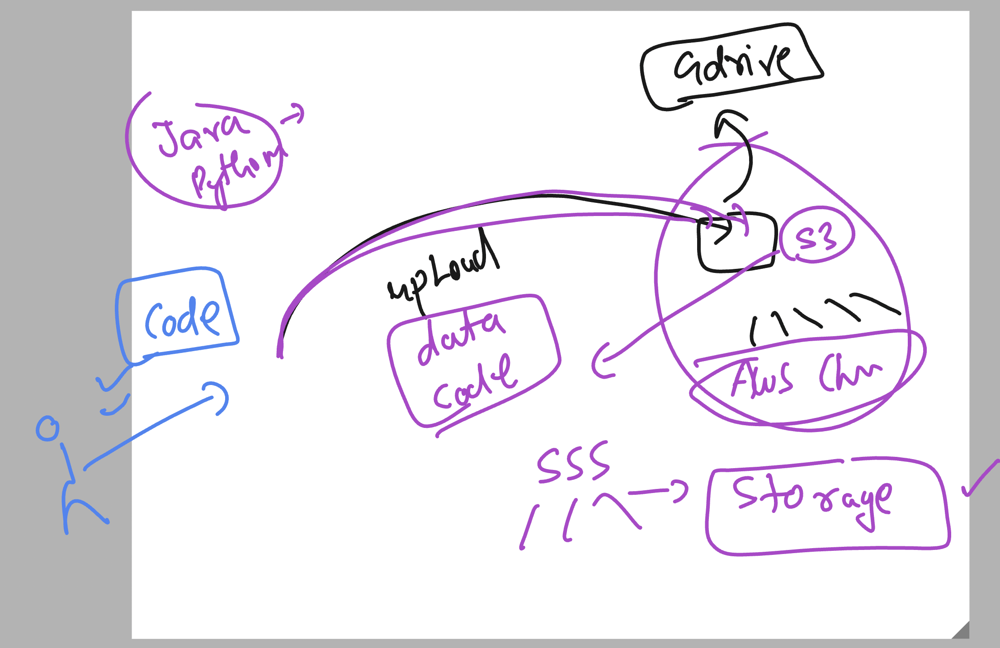
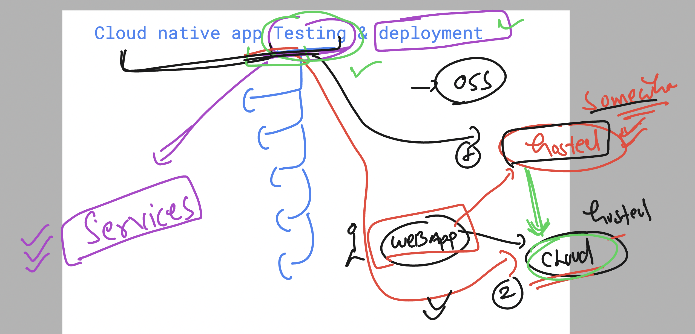
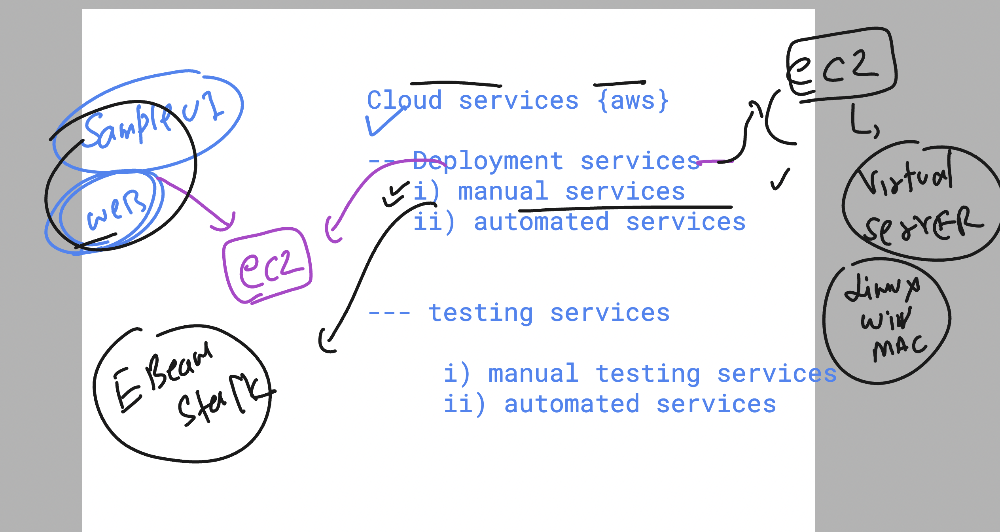
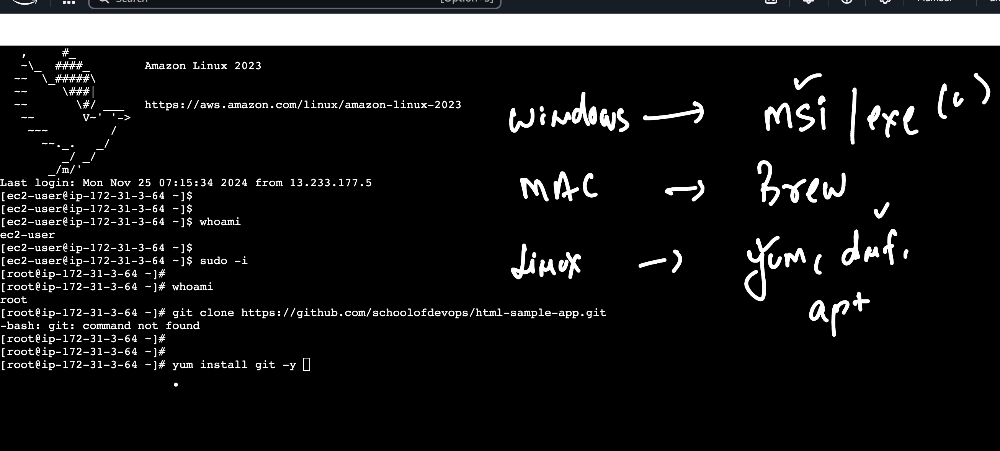

## Cloud platform things to Know 


### Avzones 


## services in cloud platform 


## S3 service in aws 



## app testing by Cloud nativ tools -- 



## Cloud based Deployment and testing services in AWS platform 



### ec2 machine launch and connect 

```
[ec2-user@ip-172-31-3-64 ~]$ whoami
ec2-user
[ec2-user@ip-172-31-3-64 ~]$ 
[ec2-user@ip-172-31-3-64 ~]$ sudo -i
[root@ip-172-31-3-64 ~]# 
[root@ip-172-31-3-64 ~]# whoami
root
[root@ip-172-31-3-64 ~]# 


```

### software installers in Diff os




### Installing git in cloud machine 

```
yum install git -y 

==> cloning github code repo 

git clone https://github.com/schoolofdevops/html-sample-app.git 


Cloning into 'html-sample-app'...
remote: Enumerating objects: 74, done.
remote: Counting objects: 100% (3/3), done.
remote: Compressing objects: 100% (3/3), done.
remote: Total 74 (delta 0), reused 0 (delta 0), pack-reused 71 (from 1)
Receiving objects: 100% (74/74), 1.38 MiB | 3.64 MiB/s, done.
Resolving deltas: 100% (5/5), done.


[root@ip-172-31-3-64 ~]# ls
html-sample-app

[root@ip-172-31-3-64 ~]# 
[root@ip-172-31-3-64 ~]# ls html-sample-app/
LICENSE.txt  README.txt  assets  elements.html  generic.html  html5up-phantom.zip  images  index.html
[root@ip-172-31-3-64 ~]# 


```

### to run any webapp code we need some app servers


### Installing and hosting webapp in apache httpd server 

```
yum install httpd -y 


==> copy code to httpd location 
cp -rf  html-sample-app/*   /var/www/html/

===> starting httpd service 

systemctl start httpd

===> checking service status

systemctl status httpd
● httpd.service - The Apache HTTP Server
     Loaded: loaded (/usr/lib/systemd/system/httpd.service; disabled; preset: disabled)
     Active: active (running) since Mon 2024-11-25 07:38:09 UTC; 4s ago
       Docs: man:httpd.service(8)
   Main PID: 28479 (httpd)
     Status: "Started, listening on: port 80"
      Tasks: 177 (limit: 1111)
     Memory: 12.9M
        CPU: 64ms
```
