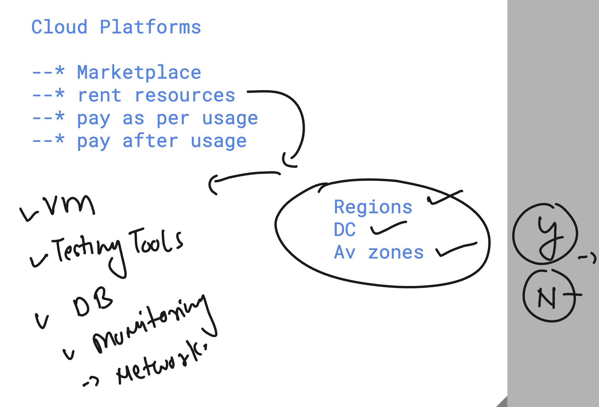
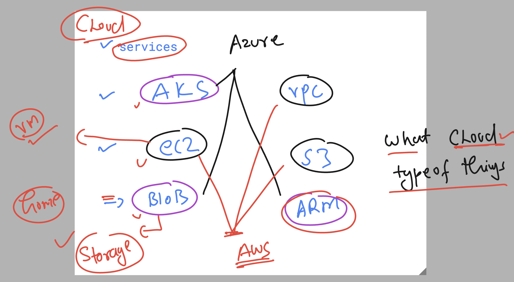

## Cloud platform things to Know 



### Avzones 


## services in cloud platform 



## S3 service in aws 


## app testing by Cloud nativ tools -- 


## Cloud based Deployment and testing services in AWS platform 


### ec2 machine launch and connect 

```
[ec2-user@ip-172-31-3-64 ~]$ whoami
ec2-user
[ec2-user@ip-172-31-3-64 ~]$ 
[ec2-user@ip-172-31-3-64 ~]$ sudo -i
[root@ip-172-31-3-64 ~]# 
[root@ip-172-31-3-64 ~]# whoami
root
[root@ip-172-31-3-64 ~]# 


```

### software installers in Diff os


### Installing git in cloud machine 

```
yum install git -y 

==> cloning github code repo 

git clone https://github.com/schoolofdevops/html-sample-app.git 


Cloning into 'html-sample-app'...
remote: Enumerating objects: 74, done.
remote: Counting objects: 100% (3/3), done.
remote: Compressing objects: 100% (3/3), done.
remote: Total 74 (delta 0), reused 0 (delta 0), pack-reused 71 (from 1)
Receiving objects: 100% (74/74), 1.38 MiB | 3.64 MiB/s, done.
Resolving deltas: 100% (5/5), done.


[root@ip-172-31-3-64 ~]# ls
html-sample-app

[root@ip-172-31-3-64 ~]# 
[root@ip-172-31-3-64 ~]# ls html-sample-app/
LICENSE.txt  README.txt  assets  elements.html  generic.html  html5up-phantom.zip  images  index.html
[root@ip-172-31-3-64 ~]# 


```