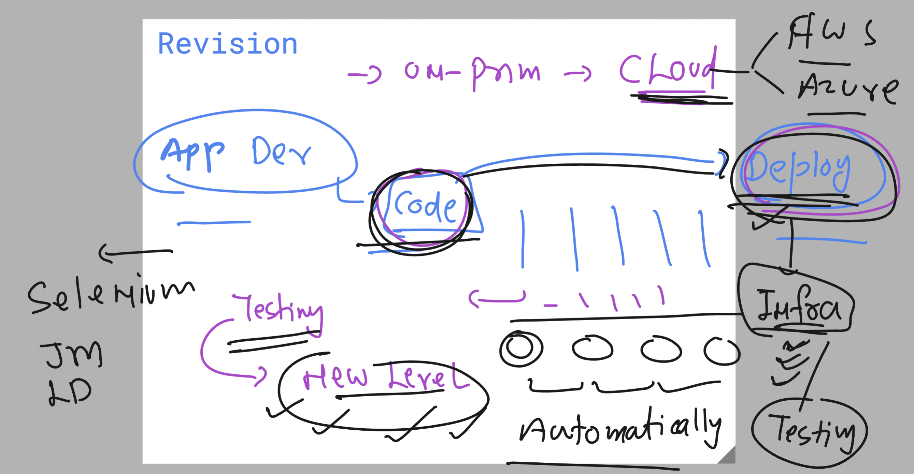
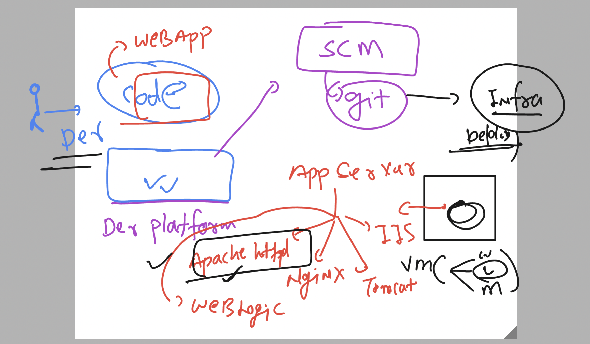
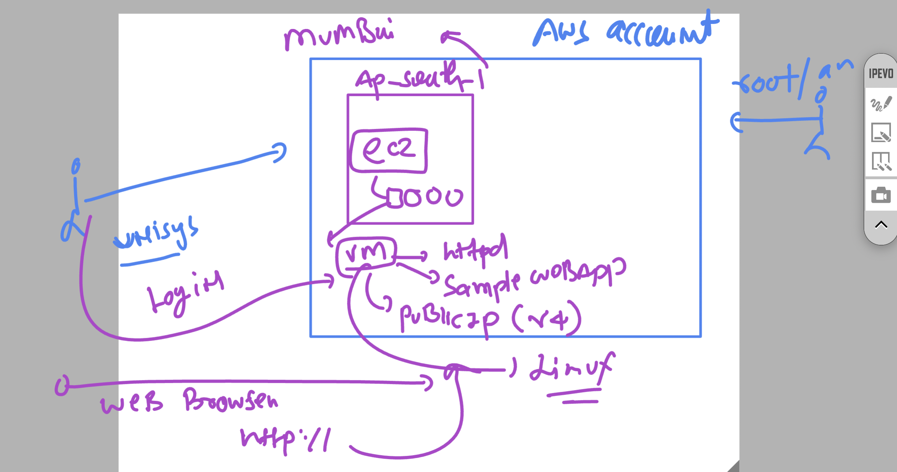
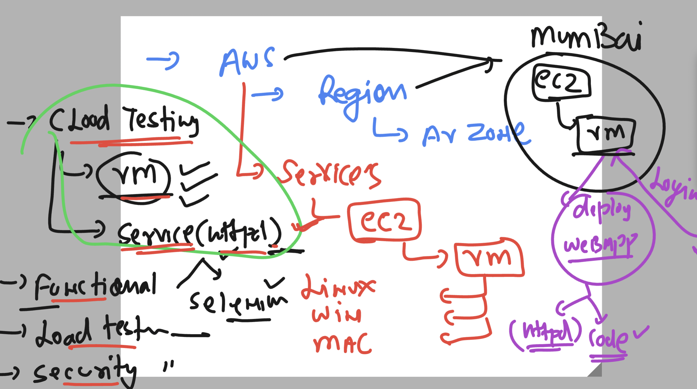
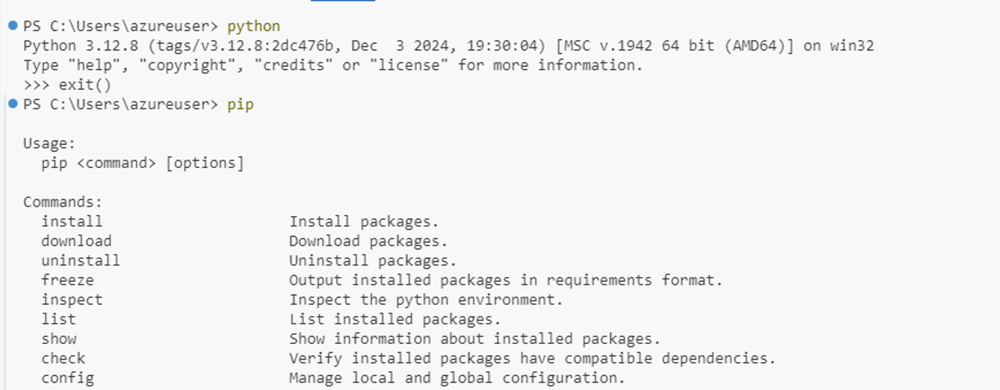

### Revision and understanding of testing importance in cloud nativ ENV



## app servers to run webapp code 



### aws cloud with ec2 service to deploy a sample webapp 



### we can login to any linux machine in any cloud using ssh / session manager


### login and check httpd service status 

```

[ec2-user@ip-172-31-3-64 ~]$ whoami
ec2-user

[ec2-user@ip-172-31-3-64 ~]$ sudo systemctl  status httpd
○ httpd.service - The Apache HTTP Server
     Loaded: loaded (/usr/lib/systemd/system/httpd.service; disabled; preset: disabled)
     Active: inactive (dead)
       Docs: man:httpd.service(8)

[ec2-user@ip-172-31-3-64 ~]$ 
[ec2-user@ip-172-31-3-64 ~]$ sudo systemctl  start httpd

[ec2-user@ip-172-31-3-64 ~]$ sudo systemctl  status httpd
● httpd.service - The Apache HTTP Server
     Loaded: loaded (/usr/lib/systemd/system/httpd.service; disabled; preset: disabled)
     Active: active (running) since Mon 2024-12-09 04:43:59 UTC; 2s ago
       Docs: man:httpd.service(8)
   Main PID: 3566 (httpd)
     Status: "Started, listening on: port 80"
      Tasks: 177 (limit: 1111)
     Memory: 17.7M
        CPU: 74ms
     CGroup: /system.slice/httpd.service
             ├─3566 /usr/sbin/httpd -DFOREGROUND
             ├─3567 /usr/sbin/httpd -DFOREGROUND
             ├─3568 /usr/sbin/httpd -DFOREGROUND

```

## Overall parameters of testing in cloud ENV 



### verify python and pip installation on windows using vscode 



### to use python coding best way to use venv 

### creating venv in windows 

```
PS C:\Users\azureuser\Desktop\webapp_test> python  -m venv  ashuenv 
PS C:\Users\azureuser\Desktop\webapp_test> .\ashuenv\Scripts\activate
(ashuenv) PS C:\Users\azureuser\Desktop\webapp_test> 
(ashuenv) PS C:\Users\azureuser\Desktop\webapp_test> 
```
