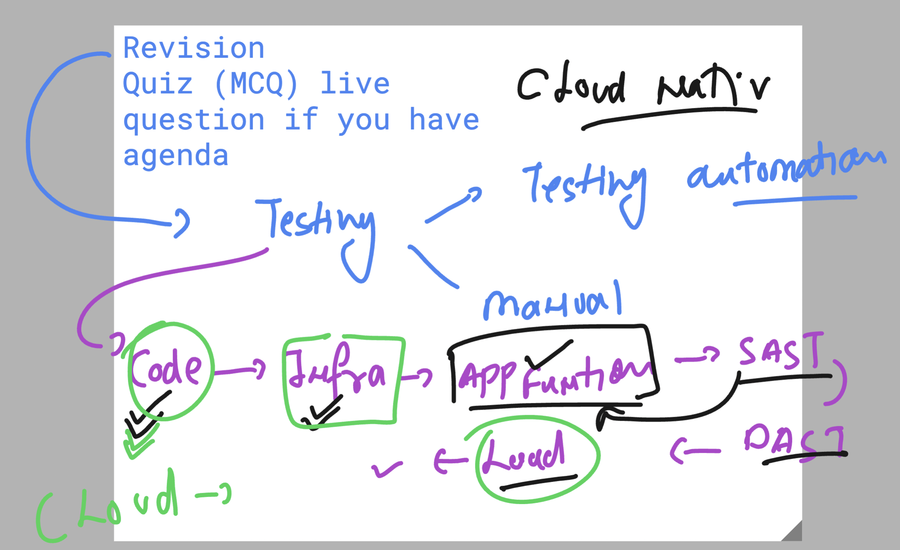

### Revision 



### Cloud infra things


### to provision and validate , fix the cloud resources -- Terraform 


### A little more info about terraform 


### checking terraform version 

```
PS C:\Users\azureuser> cd  .\Documents\
PS C:\Users\azureuser\Documents> ls


    Directory: C:\Users\azureuser\Documents


Mode                 LastWriteTime         Length Name
----                 -------------         ------ ----
d-----         12/8/2024  12:24 PM                apache-jmeter-5.6.3
-a----        12/10/2024   4:35 AM       92348072 terraform.exe


PS C:\Users\azureuser\Documents> .\terraform.exe version
Terraform v1.10.1
on windows_amd64
PS C:\Users\azureuser\Documents>

```

## Terraform Inventory 

### Providers

[click_here](https://registry.terraform.io/browse/providers)

### terraform life cycle to run the code 


### Terraform init 

```
terraform  init 
Initializing the backend...
Initializing provider plugins...
- Finding latest version of hashicorp/aws...
- Installing hashicorp/aws v5.80.0...
- Installed hashicorp/aws v5.80.0 (signed by HashiCorp)
Terraform has created a lock file .terraform.lock.hcl to record the provider  
selections it made above. Include this file in your version control repository
so that Terraform can guarantee to make the same selections by default when   
you run "terraform init" in the future.

Terraform has been successfully initialized!

You may now begin working with Terraform. Try running "terraform plan" to see
any changes that are required for your infrastructure. All Terraform commands
should now work.

If you ever set or change modules or backend configuration for Terraform,
rerun this command to reinitialize your working directory. If you forget, other
commands will detect it and remind you to do so if necessary.

```

### terraform validate 

```
 terraform validate
Success! The configuration is valid.

```

### terraform plan 

```
terraform plan      

Terraform used the selected providers to generate the following execution plan. Resource actions are indicated with the following symbols:
  + create

Terraform will perform the following actions:

  # aws_instance.ashuinstance1 will be created
  + resource "aws_instance" "ashuinstance1" {
      + ami                                  = "ami-0453ec754f44f9a4a"
      + arn                                  = (known after apply)    
      + associate_public_ip_address          = (known after apply)  
```

### terraform apply -- action 

```
terraform apply  

Terraform used the selected providers to generate the following execution plan. Resource actions are indicated with the following symbols:
  + create

Terraform will perform the following actions:

  # aws_instance.ashuinstance1 will be created
  + resource "aws_instance" "ashuinstance1" {
      + ami                                  = "ami-0453ec754f44f9a4a"
      + arn                                  = (known after apply)    
      + associate_public_ip_address          = (known after apply)    
      + availability_zone                    = (known after apply)    
      + cpu_core_count                       = (known after apply)    
      + cpu_threads_per_core                 = (known after apply)    
      + disable_api_stop                     = (known after apply)    
      + disable_api_termination              = (known after apply)    
      + ebs_optimized                        = (known after apply)    
      + get_password_data                    = false
      + host_id                              = (known after apply)    
      + host_resource_group_arn              = (known after apply)    
      + iam_instance_profile                 = (known after apply)    
      + id                                   = (known after apply)
      + instance_initiated_shutdown_behavior = (known after apply)
      + instance_lifecycle                   = (known after apply)
      + instance_state                       = (known after apply)
      + instance_type                        = "t2.micro"
      + ipv6_address_count                   = (known after apply)
      + ipv6_addresses                       = (known after apply)
      + key_name                             = "splunk-key"
      + monitoring                           = (known after apply)
      + outpost_arn                          = (known after apply)
      + password_data                        = (known after apply)
      + placement_group                      = (known after apply)
      + placement_partition_number           = (known after apply)
      + primary_network_interface_id         = (known after apply)
      + private_dns                          = (known after apply)
      + private_ip                           = (known after apply)
      + public_dns                           = (known after apply)
      + public_ip                            = (known after apply)
      + secondary_private_ips                = (known after apply)
      + security_groups                      = [
          + "default",
          + "launch-wizard-2",
        ]
      + source_dest_check                    = true
      + spot_instance_request_id             = (known after apply)
      + subnet_id                            = (known after apply)
      + tags                                 = {
          + "Name" = "ashu-vm1"
        }
      + tags_all                             = {
          + "Name" = "ashu-vm1"
        }
      + tenancy                              = (known after apply)
      + user_data                            = (known after apply)
      + user_data_base64                     = (known after apply)
      + user_data_replace_on_change          = false
      + vpc_security_group_ids               = (known after apply)

      + capacity_reservation_specification (known after apply)

      + cpu_options (known after apply)

      + ebs_block_device (known after apply)

      + enclave_options (known after apply)

      + ephemeral_block_device (known after apply)

      + instance_market_options (known after apply)

      + maintenance_options (known after apply)

      + metadata_options (known after apply)

      + network_interface (known after apply)

      + private_dns_name_options (known after apply)

      + root_block_device (known after apply)
    }

Plan: 1 to add, 0 to change, 0 to destroy.

Do you want to perform these actions?
  Terraform will perform the actions described above.
  Only 'yes' will be accepted to approve.

  Enter a value: yes

aws_instance.ashuinstance1: Creating...
aws_instance.ashuinstance1: Still creating... [10s elapsed]
aws_instance.ashuinstance1: Creation complete after 13s [id=i-00ea2dad15884325d]

Apply complete! Resources: 1 added, 0 changed, 0 destroyed.
PS C:\Users\azureuser\Desktop\terraform_codes> 

```

### terraform destroy 

```
 terraform  destroy 
aws_instance.ashuinstance1: Refreshing state... [id=i-00ea2dad15884325d]

Terraform used the selected providers to generate the following execution plan. Resource actions are indicated with the following symbols:
  - destroy

Terraform will perform the following actions:

  # aws_instance.ashuinstance1 will be destroyed
  - resource "aws_instance" "ashuinstance1" {
      - ami                                  = "ami-0453ec754f44f9a4a" -> null
      - arn                                  = "arn:aws:ec2:us-east-1:992382386705:instance/i-00ea2dad15884325d" -> null
      - associate_public_ip_address          = true -> null

```

### Terraform generic life cycle 


### aws cli configure 

```
 aws --version 
aws-cli/2.22.12 Python/3.12.6 Windows/10 exe/AMD64

PS C:\Users\azureuser\Desktop\terraform_codes> 

PS C:\Users\azureuser\Desktop\terraform_codes> aws  configure 
AWS Access Key ID [None]: ^V
AWS Secret Access Key [None]: ^Z


```

### to check terraform output data 

```
PS C:\Users\azureuser\Desktop\terraform_codes> terraform.exe  output     
ashu-vm-id = "i-05afa0570a0d99b5e"
ashu-vm-publicIP = "54.226.63.221"

```

### auzre cli link for windows 

[click_here](https://learn.microsoft.com/en-us/cli/azure/install-azure-cli-windows?tabs=azure-cli)


### checking azure cli version 

```

PS C:\Users\azureuser> az version
{
  "azure-cli": "2.67.0",
  "azure-cli-core": "2.67.0",
  "azure-cli-telemetry": "1.1.0",
  "extensions": {}
}
PS C:\Users\azureuser>


```

## INtroduction to Infra & resources config management system 

### info about ANsible 


### inventory in ansible 


### playbook in ansible -- is script to setup / check things on target resouces 


### test jump server from your local system connection 

```
 ssh  ashu@18.233.26.50
The authenticity of host '18.233.26.50 (18.233.26.50)' can't be established.
ED25519 key fingerprint is SHA256:DiMsfJwLk4XWyQ+mRxHiHLSf79jeWswtOFfs2qZNd7Y.
This key is not known by any other names.
Are you sure you want to continue connecting (yes/no/[fingerprint])? yes
Warning: Permanently added '18.233.26.50' (ED25519) to the list of known hosts.
ashu@18.233.26.50's password:
   ,     #_
   ~\_  ####_        Amazon Linux 2023
  ~~  \_#####\
  ~~     \###|
  ~~       \#/ ___   https://aws.amazon.com/linux/amazon-linux-2023
   ~~       V~' '->
    ~~~         /
      ~~._.   _/
         _/ _/
       _/m/'
[ashu@common-server ~]$


```

### checking ansible version 

```
 ansible --version 
ansible [core 2.15.3]
  config file = None
  configured module search path = ['/home/ashu/.ansible/plugins/modules', '/usr/share/ansible/plugins/modules']
  ansible python module location = /usr/lib/python3.9/site-packages/ansible
  ansible collection location = /home/ashu/.ansible/collections:/usr/share/ansible/collections
  executable location = /usr/bin/ansible
  python version = 3.9.16 (main, Jul  5 2024, 00:00:00) [GCC 11.4.1 20230605 (Red Hat 11.4.1-2)] (/usr/bin/python3.9)
  jinja version = 3.1.4
  libyaml = True

  ```

  ## ansible vs terraform 

  

  ### ansible required details understanding 

  

  ### always keep your private key secure 

  ```
  chmod  400 splunk-key.pem 
  ```

  ### pinging db group using ansible 

  ```
  ansible  -u ec2-user --private-key splunk-key.pem  -i hosts  db  -m ping 
[WARNING]: Platform linux on host 54.87.163.211 is using the discovered Python interpreter at /usr/bin/python3.9, but future installation of
another Python interpreter could change the meaning of that path. See https://docs.ansible.com/ansible-
core/2.15/reference_appendices/interpreter_discovery.html for more information.
54.87.163.211 | SUCCESS => {
    "ansible_facts": {
        "discovered_interpreter_python": "/usr/bin/python3.9"
    },
    "changed": false,
    "ping": "pong"
}
[WARNING]: Platform linux on host 3.95.172.207 is using the discovered Python interpreter at /usr/bin/python3.9, but future installation of
another Python interpreter could change the meaning of that path. See https://docs.ansible.com/ansible-
core/2.15/reference_appendices/interpreter_discovery.html for more information.
3.95.172.207 | SUCCESS => {
    "ansible_facts": {
        "discovered_interpreter_python": "/usr/bin/python3.9"
    },
    "changed": false,
    "ping": "pong"
}

```


### ansible command 

```
  21  ansible  -u ec2-user --private-key splunk-key.pem    db  -m ping 
   22  hitor
   23  history 
   24  pwd
   25  ansible  -u ec2-user    db  -m ping 
   26  ansible  -u ec2-user --private-key splunk-key.pem    db  -m ping 
   27  ansible   --private-key splunk-key.pem    db  -m ping 
   28  ansible   --private-key splunk-key.pem   webapp  -m ping
   29  ansible   --private-key splunk-key.pem    db  -m ping 
   30  ansible   --private-key splunk-key.pem   webapp  -m ping
   31  ansible   --private-key splunk-key.pem   all   -m ping

```

## Introduction to apache Jmeter (Load/Performance testing tool)


