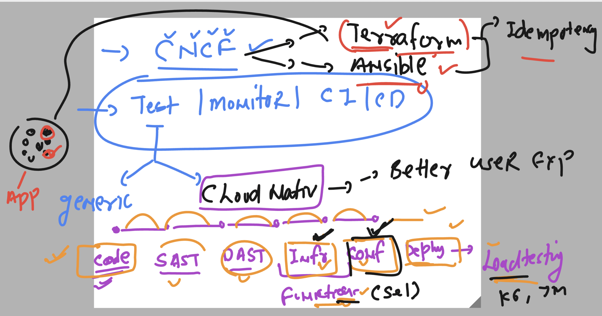
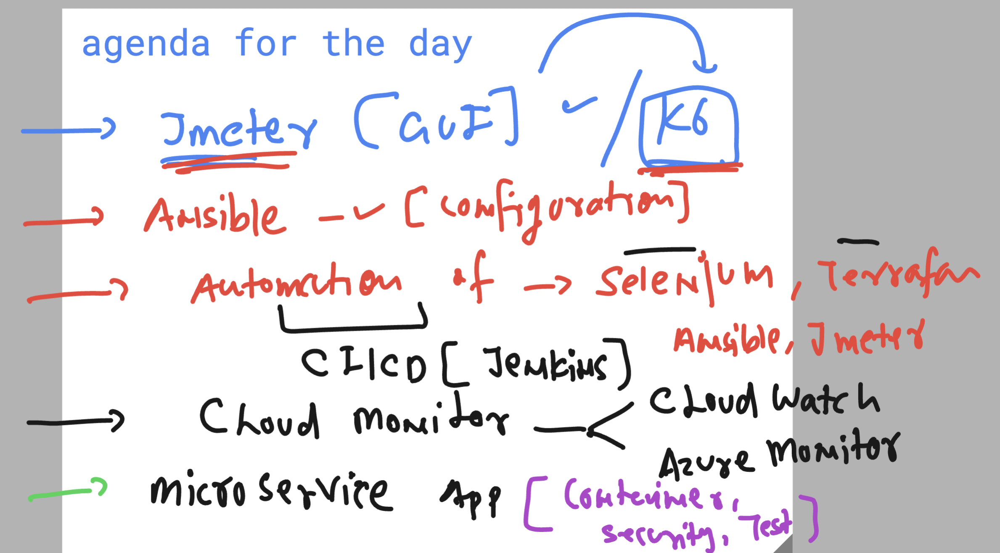

# cncf_unisystesting

### Revision for CNCF (cloud nativ computing foundation) testing 



### agenda 



### Jmeter Revision 


### testing ping connection using ansible to new 6 target host

```
ansible all  --private-key splunk-key.pem  -m ping 

```
