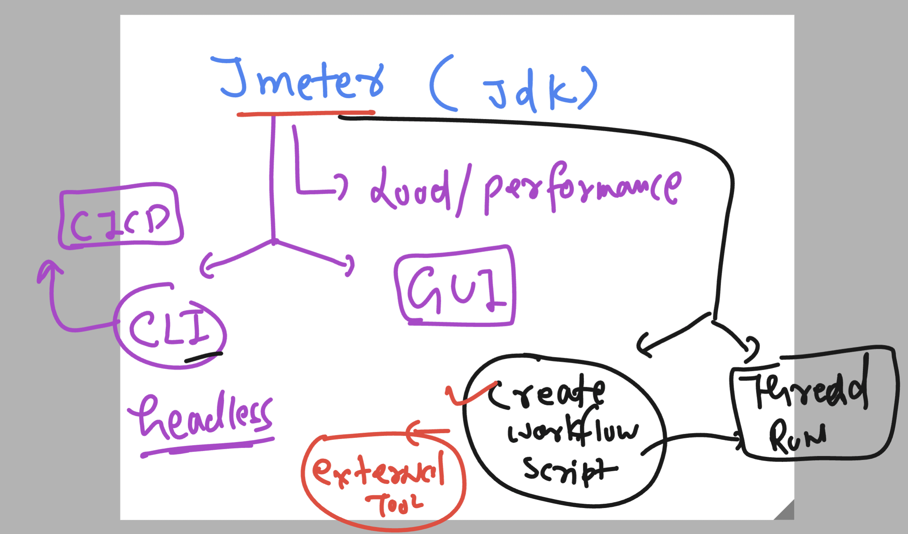
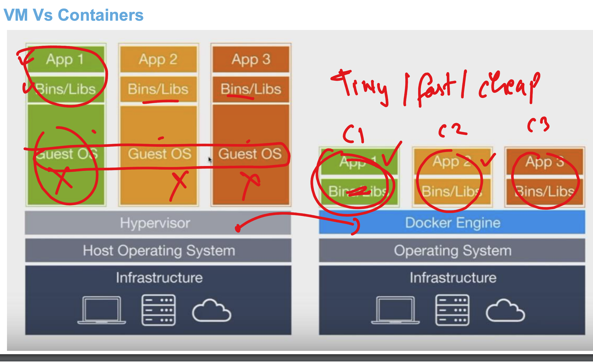

# cncf_unisystesting

### Revision for CNCF (cloud nativ computing foundation) testing 


### agenda 


### Jmeter Revision 



### testing ping connection using ansible to new 6 target host

```
ansible all  --private-key splunk-key.pem  -m ping 

```

### running playbook 

```
ansible-playbook  --private-key splunk-key.pem  setuphttpd.yaml 

PLAY [webapp] ******************************************************************************************************************************************************************

TASK [Gathering Facts] *********************************************************************************************************************************************************
[WARNING]: Platform linux on host 52.90.23.248 is using the discovered Python interpreter at /usr/bin/python3.9, but future installation of another Python interpreter could
change the meaning of that path. See https://docs.ansible.com/ansible-core/2.15/reference_appendices/interpreter_discovery.html for more information.
ok: [52.90.23.248]
[WARNING]: Platform linux on host 34.207.150.81 is using the discovered Python interpreter at /usr/bin/python3.9, but future installation of another Python interpreter could
change the meaning of that path. See https://docs.ansible.com/ansible-core/2.15/reference_appendices/interpreter_discovery.html for more information.
ok: [34.207.150.81]
[WARNING]: Platform linux on host 34.229.97.214 is using the discovered Python interpreter at /usr/bin/python3.9, but future installation of another Python interpreter could
change the meaning of that path. See https://docs.ansible.com/ansible-core/2.15/reference_appendices/interpreter_discovery.html for more information.
ok: [34.229.97.214]

TASK [installing httpd software] ***********************************************************************************************************************************************
ok: [52.90.23.248]
changed: [34.229.97.214]
changed: [34.207.150.81]

TASK [copy webapp to server] ***************************************************************************************************************************************************
changed: [52.90.23.248]
changed: [34.207.150.81]
changed: [34.229.97.214]

TASK [start service of httpd] **************************************************************************************************************************************************
ok: [52.90.23.248]

```

## Monitoring resources in azure cloud 


### containers to run apps & db & testing software etc 



### checking docker version 

```
ashu@common-server ansible_codes]$ docker  version 
Client:
 Version:           25.0.5
 API version:       1.44
 Go version:        go1.22.5
 Git commit:        5dc9bcc
 Built:             Wed Aug 21 00:00:00 2024
 OS/Arch:           linux/amd64
 Context:           default

Server:
 Engine:
  Version:          25.0.6
  API version:      1.44 (minimum version 1.24)
  Go version:       go1.22.5
  Git commit:       b08a51f
  Built:            Wed Aug 21 00:00:00 2024
  OS/Arch:          linux/amd64
  Experimental:     false
```

## container images are designed by Docker team to support apps/tools etc


### pulling images

```
[ashu@common-server ansible_codes]$ 
[ashu@common-server ansible_codes]$ docker  images
REPOSITORY   TAG       IMAGE ID   CREATED   SIZE
[ashu@common-server ansible_codes]$ docker pull python
Using default tag: latest
latest: Pulling from library/python
fdf894e782a2: Pull complete 
5bd71677db44: Pull complete 
551df7f94f9c: Pull complete 
ce82e98d553d: Pull complete 
5f0e19c475d6: Pull complete 
abab87fa45d0: Pull complete 
2ac2596c631f: Pull complete 
Digest: sha256:220d07595f288567bbf07883576f6591dad77d824dce74f0c73850e129fa1f46
Status: Downloaded newer image for python:latest
docker.io/library/python:latest
[ashu@common-server ansible_codes]$ docker  images
REPOSITORY   TAG       IMAGE ID       CREATED      SIZE
python       latest    3ca4060004b1   7 days ago   1.02GB
[ashu@common-server ansible_codes]$ 

```

### Build and run in docker containers 


### app servers info 


### docker build operation 

```
docker  build  -t  ashuwebapp:appv1  . 

```
### creating container from the image

```
 docker   run  -d  --name ashuc1  -p 1234:80  ashuwebapp:appv1 
7f3fac8a0b266a4eb68e24f9cd24279e45514e3ddc00947548018b60e5fb8ce9
[ashu@common-server ansible_codes]$ docker  ps
CONTAINER ID   IMAGE              COMMAND                  CREATED         STATUS         PORTS                                   NAMES
7f3fac8a0b26   ashuwebapp:appv1   "/docker-entrypoint.…"   4 seconds ago   Up 2 seconds   0.0.0.0:1234->80/tcp, :::1234->80/tcp   ashuc1
[ashu@common-server ansible_codes]$ 

```
