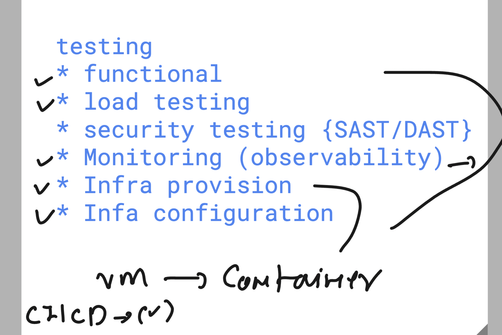

# cncf_unisystesting

## Revision 

### agenda 

### Jenkins Revision 

### Understanding headless mode in Selenium 

### pipelines in jenkins is the best way to run any use case for automation 

## Understanding security importance in Developer and Testing code 

[click_here](https://github.com/aquasecurity/trivy.git)

### Before using code do Security testing 

### mono to micro 

### Understanding container management platform

### basic info about k8s 

### basic architecture of k8s 

### k8s master and slave archecture 

## Intro to Dynatrace 

### Jmeter with jenkins 

